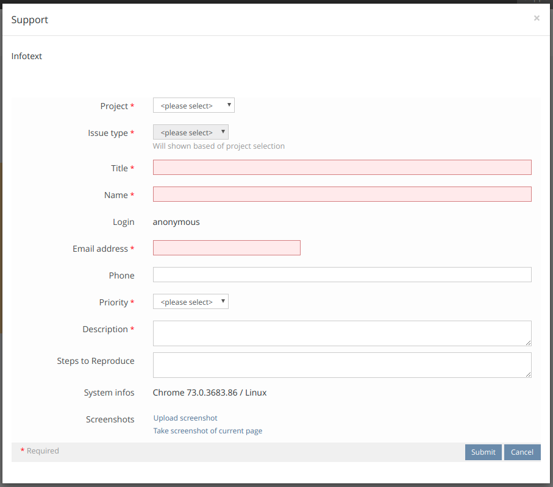
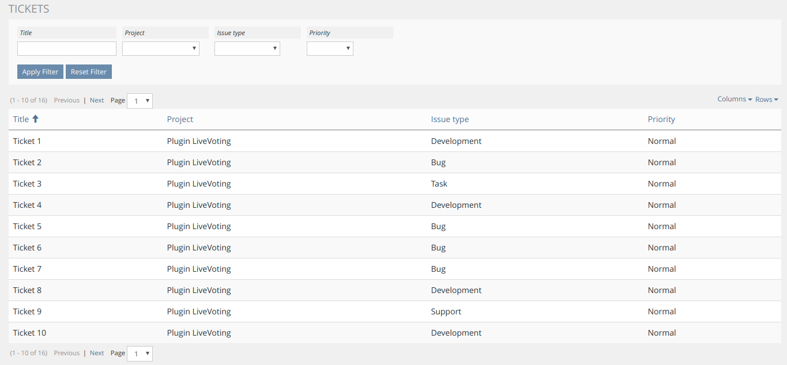
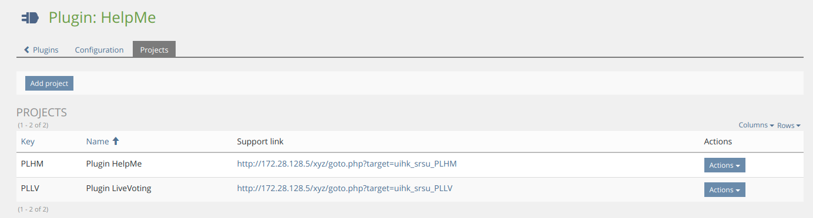
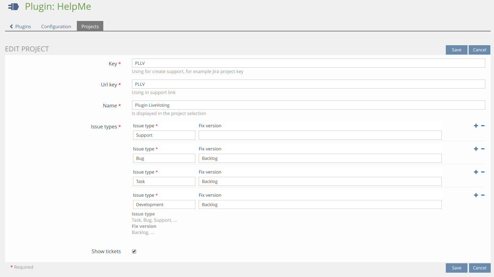

This is an OpenSource project by studer + raimann ag, CH-Burgdorf (https://studer-raimann.ch)

## Installation

### Install HelpMe-Plugin
Start at your ILIAS root directory
```bash
mkdir -p Customizing/global/plugins/Services/UIComponent/UserInterfaceHook
cd Customizing/global/plugins/Services/UIComponent/UserInterfaceHook
git clone https://github.com/studer-raimann/HelpMe.git HelpMe
```
Update, activate and config the plugin in the ILIAS Plugin Administration

Please also install and enable [HelpMeCron](https://github.com/studer-raimann/HelpMeCron), if you want to use the show tickets feature.

If yout want use the Jira recipient with oAuth authorization you can find a guide to config your Jira installation: https://developer.atlassian.com/cloud/jira/platform/jira-rest-api-oauth-authentication/

You can lock errors in the ILIAS log file like
```bash
grep HelpMe /var/iliasdata/ilias/ilias.log
```

### Notifications config
You have a `support` property (See more in [Class Support](./src/Support/Support.php)) for specific fields in both subject and body.

In body you have also a `fields` (Array of [Class SupportField](src/Support/SupportField.php)) for dynamic fields.

It uses the twig tempate engine (See more at https://twig.symfony.com/doc/1.x/templates.html).

So you can either use a for loop to fill the notification body dynamic like:
```html

<p>
	<h2>{{ field.getLabel }}</h2>
	{{ field.getValue }}
</p>
<br>

```

or fill only specific support fields like:
```html
<h1>{{ support.getTitle }}</h1>
<p>{{ support.getDescription }}</p>
<small>{{ support.getPageReference }}</small>
```

or both mixed like:
```html


<p>
	<h2>{{ field.getLabel }}</h2>
	{{ field.getValue }}
</p>
<br>


<small>{{ support.getPageReference }}</small>
```

Note: For safety reasons Jira API does not supports HTML and will escape HTML

### Some screenshots
Support button:


Support button with enabled show tickets:


Support UI:


Show tickets UI:


Config:


Config projects table:


Config project:


### Requirements
* ILIAS 5.3 or ILIAS 5.4
* PHP >=7.0

### Adjustment suggestions
* External users can report suggestions and bugs at https://plugins.studer-raimann.ch/goto.php?target=uihk_srsu_PLHM
* Adjustment suggestions by pull requests via github
* Customer of studer + raimann ag: 
	* Adjustment suggestions which are not yet worked out in detail by Jira tasks under https://jira.studer-raimann.ch/projects/PLHM
	* Bug reports under https://jira.studer-raimann.ch/projects/PLHM

### ILIAS Plugin SLA
Wir lieben und leben die Philosophie von Open Source Software! Die meisten unserer Entwicklungen, welche wir im Kundenauftrag oder in Eigenleistung entwickeln, stellen wir öffentlich allen Interessierten kostenlos unter https://github.com/studer-raimann zur Verfügung.

Setzen Sie eines unserer Plugins professionell ein? Sichern Sie sich mittels SLA die termingerechte Verfügbarkeit dieses Plugins auch für die kommenden ILIAS Versionen. Informieren Sie sich hierzu unter https://studer-raimann.ch/produkte/ilias-plugins/plugin-sla.

Bitte beachten Sie, dass wir nur Institutionen, welche ein SLA abschliessen Unterstützung und Release-Pflege garantieren.
