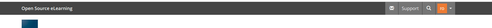
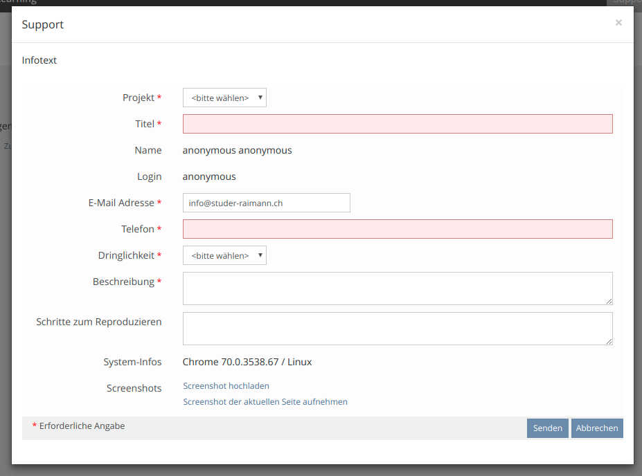
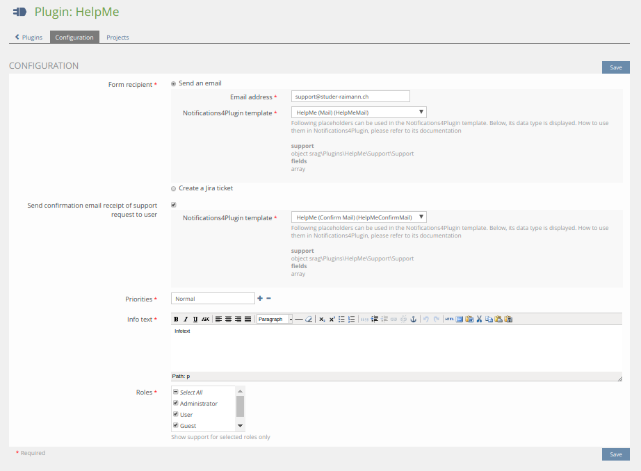
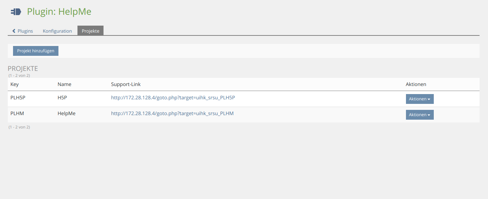

## Installation

### Install HelpMe-Plugin
Start at your ILIAS root directory
```bash
mkdir -p Customizing/global/plugins/Services/UIComponent/UserInterfaceHook
cd Customizing/global/plugins/Services/UIComponent/UserInterfaceHook
git clone https://github.com/studer-raimann/HelpMe.git HelpMe
```
Update, activate and config the plugin in the ILIAS Plugin Administration

If yout want use the Jira recipient with oAuth authorization you can find a guide to config your Jira installation: https://developer.atlassian.com/cloud/jira/platform/jira-rest-api-oauth-authentication/

You can lock errors in the ILIAS log file like
```bash
grep HelpMe /var/iliasdata/ilias/ilias.log
```

### Notifications4Plugins
You need to install [Notifications4Plugins](https://github.com/studer-raimann/Notifications4Plugins)

You have a `support` property (See more in [Class Support](./src/Support/Support.php)) in both subject and body.

In body you have also a `fields` (Key/Values)

Config a notification like the follow examples:

#### Mail
Subject:
```text
{{ support.getTitle }}
```
Text:
```html

<p>
	<h2>{{ key }}</h2>
	{{ value }}
</p>
<br>

```

#### Jira
(For safety reasons Jira API does not supports HTML and will escape HTML)

Subject:
```text
{{ support.getTitle }}
```
Text:
```text

{{ key }}:
{{ value }}



```

### Some screenshots
Support button:


Support gui:


Config:


Config projects:


### Known issues
- There is a known issue in the ILIAS core object svg icons (The `foreignObject` tag). This tag prevents to take screenshots in Chrome/Safari, because it could reveal something about the current user. [Here](https://mantis.ilias.de/view.php?id=25040) is the ILIAS Mantis report

### Dependencies
* ILIAS 5.3.14 or ILIAS 5.4
* PHP >=7.0
* [composer](https://getcomposer.org)
* [Notifications4Plugins](https://github.com/studer-raimann/Notifications4Plugins)
* [sinergi/browser-detector](https://packagist.org/packages/sinergi/browser-detector)
* [srag/activerecordconfig](https://packagist.org/packages/srag/activerecordconfig)
* [srag/custominputguis](https://packagist.org/packages/srag/custominputguis)
* [srag/dic](https://packagist.org/packages/srag/dic)
* [srag/jiracurl](https://packagist.org/packages/srag/jiracurl)
* [srag/librariesnamespacechanger](https://packagist.org/packages/srag/librariesnamespacechanger)
* [srag/removeplugindataconfirm](https://packagist.org/packages/srag/removeplugindataconfirm)
* [babel-minify -g](https://www.npmjs.com/package/babel-minify)

Please use it for further development!

### Adjustment suggestions
* Adjustment suggestions by pull requests
* Adjustment suggestions which are not yet worked out in detail by Jira tasks under https://jira.studer-raimann.ch/projects/PLHM
* Bug reports under https://jira.studer-raimann.ch/projects/PLHM
* For external users you can report it at https://plugins.studer-raimann.ch/goto.php?target=uihk_srsu_PLHM

### ILIAS Plugin SLA
Wir lieben und leben die Philosophie von Open Source Software! Die meisten unserer Entwicklungen, welche wir im Kundenauftrag oder in Eigenleistung entwickeln, stellen wir öffentlich allen Interessierten kostenlos unter https://github.com/studer-raimann zur Verfügung.

Setzen Sie eines unserer Plugins professionell ein? Sichern Sie sich mittels SLA die termingerechte Verfügbarkeit dieses Plugins auch für die kommenden ILIAS Versionen. Informieren Sie sich hierzu unter https://studer-raimann.ch/produkte/ilias-plugins/plugin-sla.

Bitte beachten Sie, dass wir nur Institutionen, welche ein SLA abschliessen Unterstützung und Release-Pflege garantieren.
