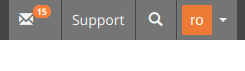
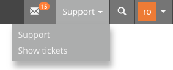

<!-- Autogenerated from composer.json - All changes will be overridden if generated again! -->

# HelpMe ILIAS Plugin

HelpMe

This is an OpenSource project by studer + raimann ag, CH-Burgdorf (https://studer-raimann.ch)

This project is licensed under the GPL-3.0-only license

## Requirements

* ILIAS 6.0 - 6.999
* PHP >=7.2

## Installation

Start at your ILIAS root directory

```bash
mkdir -p Customizing/global/plugins/Services/UIComponent/UserInterfaceHook
cd Customizing/global/plugins/Services/UIComponent/UserInterfaceHook
git clone https://github.com/fluxfw/HelpMe.git HelpMe
```

Update, activate and config the plugin in the ILIAS Plugin Administration

## Description

If you want to use the show tickets feature, you need to install the [HelpMeCron](https://github.com/studer-raimann/HelpMeCron) plugin

If yout want use the Jira recipient with oAuth authorization you can find a guide to config your Jira installation: https://developer.atlassian.com/cloud/jira/platform/jira-rest-api-oauth-authentication/

You can lock errors in the ILIAS log file like

```bash
grep HelpMe /var/iliasdata/ilias/ilias.log
```

Support button:


Support button with enabled show tickets:


Support UI:


Show tickets UI:


Config:


Config projects table:


Config project:


## Notifications config

You have a `support` property (See more in [Class Support](./src/Support/Support.php)) for specific fields in both subject and body.

In body you have also a `fields` (Array of [Class SupportField](src/Support/SupportField.php)) for dynamic fields.

It uses the twig tempate engine (See more at https://twig.symfony.com/doc/1.x/templates.html).

So you can either use a for loop to fill the notification body dynamic like:

```html
<p>	<h2>{{ field.label |e }}</h2>	{{ field.value |e }}</p><br>
```

or fill only specific support fields like:

```html
<h1>{{ support.title |e }}</h1><p>{{ support.description |e }}</p>
<small>{{ support.page_reference |e }}</small>
```

or both mixed like:

```html
<p>	<h2>{{ field.label |e }}</h2>	{{ field.value |e }}</p><br>
<small>{{ support.page_reference |e }}</small>
```

Note: For safety reasons Jira API does not supports HTML and will escape HTML

## Adjustment suggestions

You can report bugs or suggestions at https://plugins.studer-raimann.ch/goto.php?target=uihk_srsu_PLHM

There is no guarantee this can be fixed or implemented

## ILIAS Plugin SLA

We love and live the philosophy of Open Source Software! Most of our developments, which we develop on behalf of customers or on our own account, are publicly available free of charge to all interested parties at https://github.com/studer-raimann.

Do you use one of our plugins professionally? Secure the timely availability of this plugin for the upcoming ILIAS versions via SLA. Please inform yourself under https://studer-raimann.ch/produkte/ilias-plugins/plugin-sla.

Please note that we only guarantee support and release maintenance for institutions that sign a SLA.
